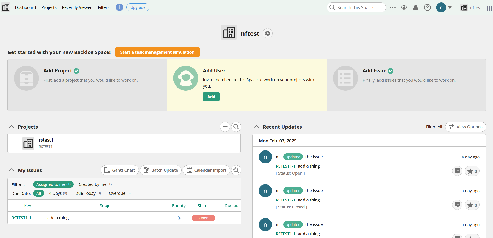

# Exploring Code Hosting and Issue Tracking Alternatives

BugTrack, our issue tracker, is fast, but _old_, and its age shows in myriad ways.
BeanStalk, our git host, is also old and is lacking in many modern features.

In this document we explore alternatives to both BugTrack and BeanStalk.

Our evaluation criteria is somewhat loose, but it follows an outline like the following:

* Hosting and Platform Type
  - **Third-Party Hosting**
    - Hosted by a third-party provider (self-hosting is not an option, as per yk orders).
  - **Platform Positioning**
    - Not a market-leading platform (as per yk orders).
* Repository and Project Management
  - **Repository Hosting**
    - Unlimited repositories for storage.
  - **Project Organization**
    - Ability to create and manage a large number of projects.
    - Support for project pages or wikis for documentation.
* Team and User Management
  - **Team Management**
    - Create and manage teams with specific member subsets.
  - **User Permissions**
    - Granular access controls for users, including:
        - Project access
        - Repository access
        - Code write/read access
        - Issue write/read access
* Issue Tracking and Workflow
  - **Issue Tracker Features**
    - Kanban board for visual task management.
    - Grouping issues by project or categories.
    - Confidential issues for private discussions.
    - Backlog management for tracking tasks and progress.
    - Prioritization of tasks/issues.
    - Tags and labels for better categorization.
    - Markdown support for formatting issues.
    - Ability to attach files to issues.
    - Ability to edit issues
    - Ability to reasisgn issues
* Code Security and Protection
  - **Code and Branch Protections**
    - Support for Git commit signing to ensure code integrity.
    - Branch merge protections to prevent unauthorized changes.
* Integrations and Usability
  - **Integration with External Tools**
    - Integration with TeamCity for CI/CD pipelines.
    - Integration with Slack for team notifications and collaboration.
  - **User Interface and Speed**
    - Fast, responsive user interface for a smooth experience.

It's okay for an offering to not have everything. It may even be the case that two offerings, an issue tracker specifically, and a code repo by itself, are the accepted recommendation. This grading criteria is fluid, and is mainly to show what each solution is capable of.

# Items under consideration

We will be evaluating the following hosted solutions:

* [codebase](https://www.codebasehq.com/features)
* [cloudforge](https://cloudforge.solutions/about)
* [perforce](https://www.perforce.com/products/helix-teamhub/pricing)
* [rhodecode](https://code.rhodecode.com/)
* [Backlog](https://nulab.com/backlog/)
* [Gitea](https://gitea.com)

# Items not under consideration
The following platforms have been rejected out-of-hand:

* [github](https://github.com)
  * GitHub is the market leader, and though their UI is good, they have increasing amounts of downtime
* [gitlab](https://gitlab.com)
  * GItLab has recently hired a CEO that has a history of prepping companies for sale. This, with GitLab's known money problens, means GitLab itself is likely for sale as well. This instability and uncertainty is not desired. Plus GitLab can be slow.
* [bitbucket](https://bitbucket.com)
  * BitBucket is an Atlassian offering, and Atlassion, much like Oracle, is not to be engaged under any circumstacne. Plus, they are slow.
* [codeberg](https://codeberg.com)
  * A nice interface, but is community hosted and explicitly for OSS projects. There is no paid option.
* [launchpad](https://launchpad.net)
  * Projects are open source by default, but private licensing is available. However, it "requires authorization from Canonical." 

  Furthermore, the following platforms have good UIs and hosted solutions may use them, but are not themselves a hosted solution:
  * [forgejo](https://forgejo.org/)
  * [gogs](https://gogs.io/)

=

| **Category**                                                                        |**Gitea**|**Backlog**| **Codebase**| **Perforce**  | **RhodeCode**| **CloudForge**|
|---                                                                                  |---      |---        |-------------|---------------|-------------|--------------|
| <h4>Hosting</h4>                                                                    |         |           |             |               |             |              |
|                                                                                     |         |           |             |               |             |              |
| Accesible in China                                                                  |☑        |?          |?           |?              |?            |?             |
| Hostable in EU                                                                      |☑        |?          |?            |?              |?            |?             |
| Hostable in US                                                                      |x        |?          |?            |?              |?            |?             |
| Hostable in JP                                                                      |x        |?          |?            |?              |?            |?             |
|                                                                                     |         |           |             |               |             |              |
| <h4>Repostory and Project Management</h4>                                           |         |           |             |               |             |              |
|                                                                                     |         |           |             |               |             |              |
| Unlimited repositories for storage.                                                 |☑        |☑          |☑            |?             |?            |?             |
| Ability to create and manage a large number of projects.                            |☑        |x          |☑            |?             |?            |?             |
| Support for project pages or wikis for documentation.                               |☑        |☑          |☑            |☑            |?            |?             |
|                                                                                     |         |           |             |              |              |              |
| <h4>Team and User Management<h4>                                                    |         |           |             |              |              |              |
|                                                                                     |         |           |             |              |              |              |
| Create and manage teams with specific member subsets.                               |☑        |o          |☑            |☑            |?             |?             |
| Granular access controls for users:                                                 |☑        |o          |☑            |o            |?              |?             |
| Project access                                                                      |☑        |o          |☑            |?            |?              |?             |
| Repository access                                                                   |☑        |o          |o            |?            |?              |?             |
| Code write/read access                                                              |☑        |o          |o            |?            |?              |?             |
| Issue write/read access                                                             |☑        |o          |☑            |?            |?              |?             |
|                                                                                     |         |           |             |              |              |              |
| <h4>Issue Tracking and Workflow<h4>                                                 |         |           |             |              |              |              |
|                                                                                     |         |           |             |              |              |              |
| Kanban board for visual task management.                                            |☑        |☑          |o            |o            |?             |?             |
| Grouping issues by project or categories.                                           |☑        |☑         |o            |☑            |?             |?             |
| Confidential issues for private discussions.                                        |x        |x          |?            |?            |?             |?             |
| Backlog management for tracking tasks and progress.                                 |☑        |☑          |☑            |☑            |?             |?            |
| Prioritization of tasks/issues.                                                     |☑        |☑          |☑            |☑            |?             |?            |
| Tags and labels for better categorization.                                          |☑        |o          |☑            |o            |?             |?             | 
| Markdown support for formatting issues.                                             |☑        |☑          |☑            |☑            |?             |?            |
| Ability to attach files to issues.                                                  |☑        |☑          |☑            |☑            |?             |?            |
|                                                                                     |         |           |             |              |              |              | 
| <h4>Code Security and Protection<h4>                                                |         |           |             |              |              |              | 
|                                                                                     |         |           |             |              |              |              | 
| Support for Git commit signing to ensure code integrity.                            |☑        |?          |x            |x             |?             |?             | 
| Branch merge protections to prevent unauthorized changes.                           |☑        |x          |x            |x             |?             |?             | 
|                                                                                     |         |           |             |              |              |              | 
| <h4>Integrations and Usability<h4>                                                  |         |           |             |              |              |              | 
|                                                                                     |         |           |             |              |              |              | 
| Integration with TeamCity for CI/CD pipelines.                                      |☑        |☑          |☑            |x             |?             |?            |
| Integration with Slack for team notifications and collaboration.                    |☑        |☑          |☑            |x             |?             |?            |
| Fast UI                                                                             |☑        |☑          |☑            |☑            |?             |?             |
| Smooth, Reactive UI                                                                 |☑        |☑          |x            |o             |?             |?             |

☑ = has = kind of has  
x = doesn't have  
? - inconclusive

# [Backlog](https://nulab.com/backlog/)

|Third Party | Not Market Leader | Unlimited Repos | Large # Projects |Project pages |Maage teams|granular access|project r/w|repo r/w|code r/w|issue r/w|kanban|issue grouping|private issues|backlog tracking|task prio|tags|issue markdown|issue attachments|commit signing|branch protection|TeamCity integration|Slack integration|Fast UI| Smooth UI|
|---         |---                |---              |---               |---           |---        |---            |---        |---     |---     |---      |---    |---          |---           |---             |---      |--- |---           |---               |---          |---              |---                 |---              |---     |---      |
|   ☑       |     ☑             |☑                |x               |☑             |o          |o              |o          |o       |o       |o        |☑      |o            |x             |☑              |☑       |o    |☑            |☑                 |?            |x                |x                   |☑               |☑       |☑      |

## tl;dr recommendation
**yes**

## Pricing

¥33,858 / year, with 30 users, 1gb, and 5 projects.
¥200,640 / year with infinite users, 30gb, and 100 projects

## Overview
(+) Fukuoka, Japan based  
(+) Has kanban  
(-) Kanban is one per project  
(+) Kanban has view filters  
(-) Busy UI  
(+) Fast  
(+) Very functional  
(+) Has access controls 
(-) Access controls are locked behind premum plans  
(-) Custom issue labels locked behind super premium  
(+) Multiple git repos per project, allowing for linked repositories  

Has a busy UI with a mid 2010's Bootstrap CSS feel, but is functional.

Has a Kanban board, but is one-per-project. But custom filters make it possible to ad-hoc create different views.

Has markdown formatting and file attachments, an on-the-fly categorization of issues.

Contains a wiki for pages.

# [Gitea](https://gitea.com)

|Third Party | Not Market Leader | Unlimited Repos | Large # Projects |Project pages |Maage teams|granular access|project r/w|repo r/w|code r/w|issue r/w|kanban|issue grouping|private issues|backlog tracking|task prio|tags|issue markdown|issue attachments|commit signing|branch protection|TeamCity integration|Slack integration|Fast UI| Smooth UI|
|---         |---                |---              |---               |---           |---        |---            |---        |---     |---     |---      |---    |---          |---           |---             |---      |--- |---           |---               |---          |---              |---                 |---              |---     |---      |
|   ☑       |     ☑             |☑                |☑               |☑             |☑          |☑             |☑         |☑      |☑       |☑        |☑ 　   |☑           |x             |☑              |☑       |☑   |☑            |☑                 |☑            |☑                |☑                   |☑               |☑       |☑      |

## tl;dr recommendation
**yes**

## Pricing

With cloud pricing discount for 20 users, $190 (~30,000円)/ month

## Overview

(+) Basically github  
(+) Fast  
(+) Upstream of good OSS code hosts like Forgejo, and downstream of GOGS.  
(+) Only one of the solutions evaluated to have commit signing   
(+) Only one of the solutions evaluated to have branch protection  
(+) Highly fine grained access controls  
(+) Highly customizable kanban boards with custom columns  
(-) Pricy?  

This is my overall favorite recommendation.

# [Codebase](https://www.codebasehq.com/features)

|| Third Party | Not Market Leader | Unlimited Repos | Large # Projects |Project pages |Maage teams|granular access|project r/w|repo r/w|code r/w|issue r/w|kanban|issue grouping|private issues|backlog tracking|task prio|tags|issue markdown|issue attachments|commit signing|branch protection|TeamCity integration|Slack integration|Fast UI| Smooth UI|
|--- |---      |---                |---              |---               |---           |---        |---            |---        |---     |---     |---      |---    |---          |---           |---             |---      |--- |---           |---               |---          |---              |---                 |---              |---     |---      |
|    | ☑      | ☑                 | ☑              | o | ☑ | ☑ | o | o | o | o | o | o | ☑ | ? | ☑ | ☑ | ☑ | ☑ | ☑ | x | x | x | o | ☑ | o |

## tl;dr recommendation:
**Weak Yes**

## Pricing
$50 GBP (~10,000円) / month, unlimited users, 14gb disk space, 45 projects

## Overview

(-) Suspicious signup process. Signing up for Codebase signs me up for aTech Media as well??  
(-) Overly simple HTML UI  
(-) Simple UI means doing dynamic work like creating labels is annoying.  
(-) Kanban is one-per-project  
(-) Coarse access controlss  
(+) Fast.  

Acceptable, but feels dated, like working with 2007-era tech. Lack of reactive UI means the UX can be slow to achieve certain outcomes. 
Access controls are also coarse -- a lot of categories but is all-or-nothing.

# [Cloudforge](https://cloudforge.solutions/about)

|Third Party | Not Market Leader | Unlimited Repos | Large # Projects |Project pages |Maage teams|granular access|project r/w|repo r/w|code r/w|issue r/w|kanban|issue grouping|private issues|backlog tracking|task prio|tags|issue markdown|issue attachments|commit signing|branch protection|TeamCity integration|Slack integration|Fast UI| Smooth UI|
|---      |---                |---              |---               |---           |---        |---            |---        |---     |---     |---      |---    |---          |---           |---             |---      |--- |---           |---               |---          |---              |---                 |---              |---     |---      |
|   ☑    |     ☑             |                 |                  |              |           |               |           |        |        |         |       |             |              |                |         |    |              |                  |             |                 |                    |                 |        |         |

## tl;dr recommendation:
**Strong No**

## Pricing
Unknown.

## Overview

They can't even keep their own landing page up to date:

# [Perforce](https://www.perforce.com/products/helix-teamhub/pricing) Helix Team Hub

|| Third Party | Not Market Leader | Unlimited Repos | Large # Projects |Project pages |Maage teams|granular access|project r/w|repo r/w|code r/w|issue r/w|kanban|issue grouping|private issues|backlog tracking|task prio|tags|issue markdown|issue attachments|commit signing|branch protection|TeamCity integration|Slack integration|Fast UI| Smooth UI|
|--- |---      |---                |---              |---               |---           |---        |---            |---        |---     |---     |---      |---    |---          |---           |---             |---      |--- |---           |---               |---          |---              |---                 |---              |---     |---      |
|    |   ☑     |    ☑             |     ?           |       ?          |     ☑        |     ☑     |        ?      |       ?   |  ?     |   ?    |   ?     |  o    |    ☑       |     ?        |       ☑       |  ☑     | o  |    ☑         |      ☑           |     x       |        x        |        x           |           ☑    |    ☑   |    os    |

## tl;dr recommendation:
**Weak No**

Too enterprisey.

## Pricing
"Contact Us"

## Overview

Very enterprisey, too many features, overly polished website that avoids showing the problem and the solution.  
Seems to be the code repo host of choice for big game companies like Ubisoft and EA.

(+) Kind of modern  
(-) But 2014 kind of modern  
(+) Github influenced code repo  
(-) Code UI is slow to fetch from server  
(+) Has kanban  
(-) Kanbab is very limited  
(+) Access controls  
(-) Unclear granularity of access controls  
(-) Issues are mandatorily joined to a "milestone" (project)  
(-) Tags interface is clunky, slow  

# [rhodecode](https://code.rhodecode.com/)

|Third Party | Not Market Leader | Unlimited Repos | Large # Projects |Project pages |Maage teams|granular access|project r/w|repo r/w|code r/w|issue r/w|kanban|issue grouping|private issues|backlog tracking|task prio|tags|issue markdown|issue attachments|commit signing|branch protection|TeamCity integration|Slack integration|Fast UI| Smooth UI|
|---      |---                |---              |---               |---           |---        |---            |---        |---     |---     |---      |---    |---          |---           |---             |---      |--- |---           |---               |---          |---              |---                 |---              |---     |---      |
|   ☑    |     ☑             |                 |                  |              |           |               |           |        |        |         |       |             |              |                |         |    |              |                  |             |                 |                    |                 |        |         |

## tl;dr recommendation:

**Inconclusive**

Couldn't get the installer to run.

## Pricing
$180 (~28,000円) USD / month for 10 users, with each additional user $5(~800円), up to maximum 60 users.

## Overview

RhodeCode is sometimes recommended in niche circle -- they seem fine, but the hosted vesion is not free, even for trial users, and I could not get the docker-based installer to run. I was unable to test this myself.

Their features are fairly extensive though, and they look modern-ish. But can't make any concrete recommendations one way or the other.

